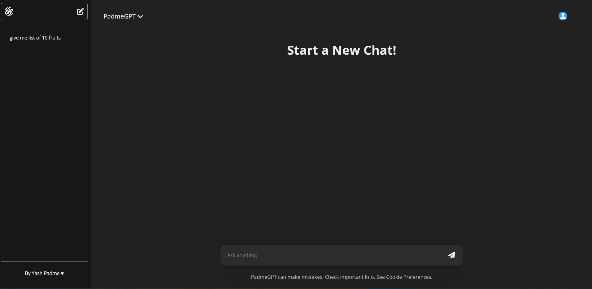
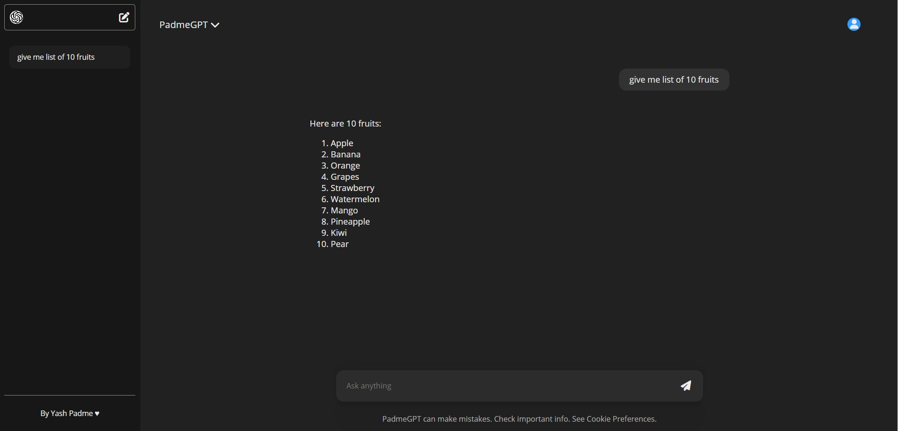

# 🤖 PadmeGPT

A full-stack AI chat application powered by **OPENAI gpt-4o-mini** with persistent conversation threads, markdown rendering, and code syntax highlighting.

## ✨ Features

* 🤖 AI-powered chat using gpt-4o-mini
* 🧵 Persistent conversation threads
* 💬 Multiple chat history support
* 📝 Markdown rendering
* 💻 Syntax highlighting for code blocks
* ⚡ Typing animation
* 📚 Sidebar with previous conversations
* 🗑️ Delete chat threads
* ⏳ Loading indicator
* 📱 Responsive UI

## 🛠️ Tech Stack

### Frontend

* React (Vite)
* Context API
* React Markdown
* rehype-highlight
* highlight.js
* react-spinners

### Backend

* Node.js
* Express.js
* MongoDB
* Mongoose
* Gemini API
* dotenv
* CORS

PadmeGPT-main\Frontend\src\assets\Homepage.png

## 📸 Screenshots

| Home                        | Chat                        |
| --------------------------- | --------------------------- |
|  |  |

## 🚀 Getting Started

### Clone the repository

```bash
git clone https://github.com/YOUR_USERNAME/PadmeGPT.git
cd PadmeGPT
```

### Backend

```bash
cd Backend
npm install
```

Create a `.env` file:

```env
MONGODB_URI=your_mongodb_connection_string
Gemini_API_Key=your_gemini_api_key
```

Start the server:

```bash
npm run start
```

### Frontend

```bash
cd Frontend
npm install
npm run dev
```

## 📂 Project Structure

```text
PadmeGPT/
├── Backend/
├── Frontend/
├── screenshots/
└── README.md
```

## 🔮 Future Improvements

* User authentication
* Streaming AI responses
* Thread rename/search
* Docker support
* File uploads
* Production deployment

## 👨‍💻 Author

**Yash Padme**

⭐ If you found this project useful, consider giving it a star on GitHub!
